```{r setup, include=FALSE}
knitr::opts_chunk$set(echo = TRUE)
```

## Darstellung der Standorte auf der Hessenwiese

```{r echo=FALSE}
library(leaflet)
# Creating different icons
icon_blue <- awesomeIcons(
  icon = 'ios-close',
  iconColor = 'white',
  library = 'ion',
  markerColor = "blue")
icon_red <- awesomeIcons(
  icon = 'ios-close',
  iconColor = 'white',
  library = 'ion',
  markerColor = "red")
```


```{r echo=FALSE}
allendorfer_rosenapfel <- paste(sep = "<br/>",
                   paste0("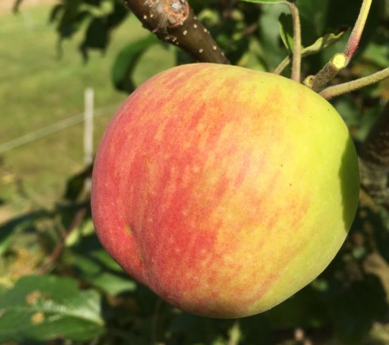"),
                   paste0("<b>Name: </b>", "Allendorfer Rosenapfel"),
                   paste0("<b>Aussehen: </b>", "s. Abb."),
                   paste0("<b>Herkunft: </b>", "Lokalsorte aus Allendorf bei Gießen"),
                   paste0("<b>Geschmack: </b>", "Wohlschmeckende Lokalsorte"),
                   paste0("<b>Besonderheit: </b>", "Anbau für alle Lagen geeignet"),
                   paste0("<b>Verwendung: </b>", "Tafelapfel"),
                   paste0("<a href='https://shop.pomologen-verein.de/Obstsorten-regional/Erhaltenswerte-Obstsorten-fuer-Hessen?source=2&refertype=7&referid=124", "'>Quelle</a>"))

roter_rambur <- paste(sep = "<br/>",
                    paste0("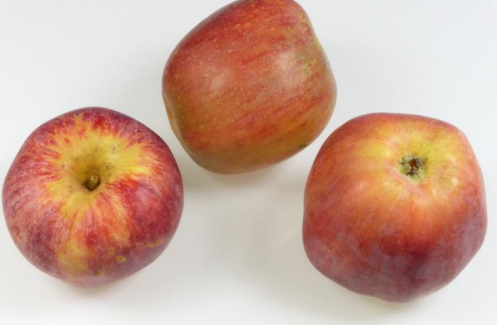"),
                    paste0("<b>Name: </b>", "Alzenauer Roter Rambur"),
                    paste0("<b>Aussehen: </b>", "Fruchtfleisch innen weiß, mittelgroß"),
                    paste0("<b>Herkunft: </b>", "Unbekannt"),
                    paste0("<b>Geschmack: </b>", " Süß-säuerlich, schwach aromatisch"),
                    paste0("<b>Besonderheit: </b>", "Mittelstarker Wuchs, frosthart"),
                    paste0("<b>Verwendung: </b>", "Tafelapfel oder Wirtschaftsapfel"),
                    paste0("<a href='https://www.schlaraffenburger.de/cms/index.php/dokumente/sortenbeschreibungen/407-sorten-portrait-alzenauer-roter-rambur/file", "'>Quelle</a>"))

anhalter <- paste(sep = "<br/>",
                    paste0(""),
                    paste0("<b>Name: </b>", "Anhalter"),
                    paste0("<b>Aussehen: </b>", "Fruchtfleisch grünlich weiß, <br> Schale glatt und trocken"),
                    paste0("<b>Herkunft: </b>", "Unbekannt"),
                    paste0("<b>Geschmack: </b>", "Ohne besonderes Aroma, etwas herb"),
                    paste0("<b>Besonderheit: </b>", "Anspruchslos an Boden und Klima, widerstandsfähige Regionalsorte"),
                    paste0("<b>Verwendung: </b>", "Herstellung von Apfelwein"),
                    paste0("<a href='https://www.pomologen-verein.de/media/user_upload/Landesgruppen/Faltblatt_Lokalsorte_2015.pdf", "'>Quelle</a>"
                           ," & <a href='https://shop.pomologen-verein.de/Obstsorten-regional/Erhaltenswerte-Obstsorten-fuer-Hessen?source=2&refertype=7&referid=124", "'>Quelle</a>"))

ausbacher_roter  <- paste(sep = "<br/>",
                    paste0("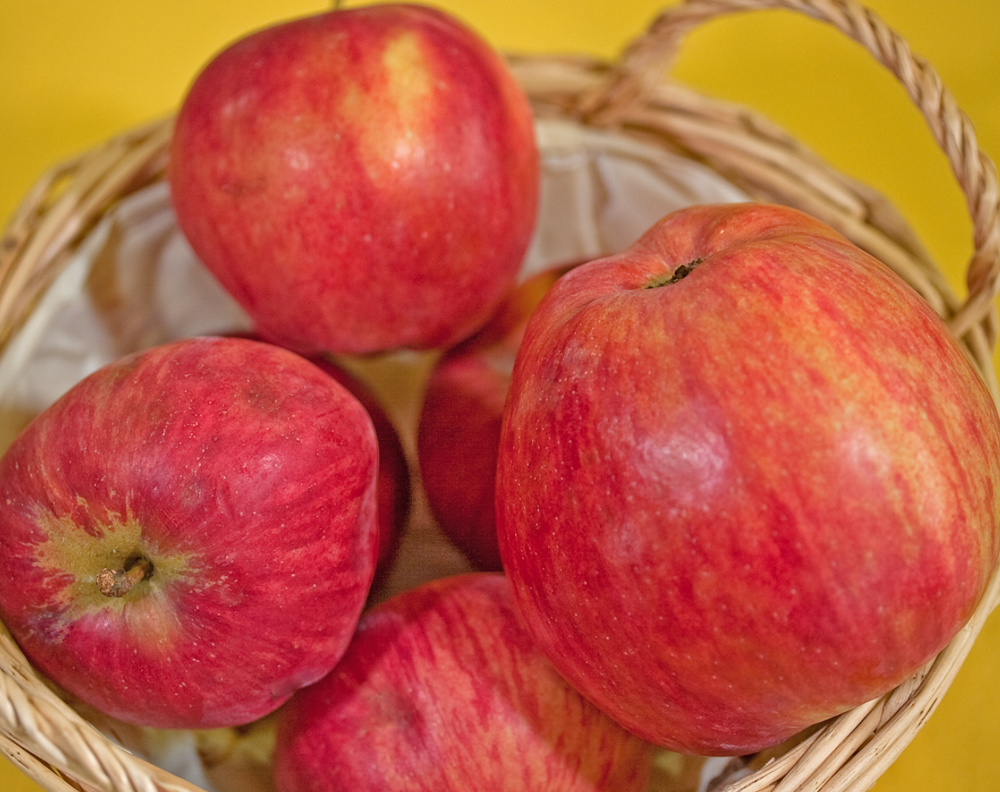"),
                    paste0("<b>Name: </b>", "Ausbacher Roter"),
                    paste0("<b>Aussehen: </b>", "groß bis sehr groß, Fruchtfleisch weiß"),
                    paste0("<b>Herkunft: </b>", "Unbekannt, evtl.Schloss Philippstal, Hessen, vor 1800"),
                    paste0("<b>Geschmack: </b>", "Saftig, schwach-säuerlich, <br> ohne Ausgeprägtes Aroma"),
                    paste0("<b>Besonderheit: </b>", "Anspruchslos an Boden und Klima"),
                    paste0("<b>Verwendung: </b>", "Wirtschaftsapfel, Mostapfel"),
                    paste0("<a href='https://www.pomologen-verein.de/media/user_upload/Landesgruppen/Faltblatt_Lokalsorte_2008.pdf", "'>Quelle</a>"
                           ," & <a href='https://shop.pomologen-verein.de/Obstsorten-regional/Erhaltenswerte-Obstsorten-fuer-Hessen?source=2&refertype=7&referid=124", "'>Quelle</a>"))

beerbacher_taffetapfel  <- paste(sep = "<br/>",
                    paste0(""),
                    paste0("<b>Name: </b>", "Beerbacher Taffetapfel"),
                    paste0("<b>Aussehen: </b>", "Mittelgroß, Fruchtfleisch weiß"),
                    paste0("<b>Herkunft: </b>", "Lokalsorte aus Südhessen, vor 1900"),
                    paste0("<b>Geschmack: </b>", "Saftig, angenehm säuerlich"),
                    paste0("<b>Besonderheit: </b>", "Anspruchslos und robust"),
                    paste0("<b>Verwendung: </b>", "Wirtschaftsapfel, Mostapfel"),
                    paste0("<a href='https://shop.pomologen-verein.de/Obstsorten-regional/Erhaltenswerte-Obstsorten-fuer-Hessen?source=2&refertype=7&referid=124"
                           , " & <a href='https://www.deutsche-genbank-obst.de/passport/index?width=2543&list=off&PassportCacheSearch%5Bart%5D=2&PassportCacheSearch%5Bleitname%5D=Beerbacher+Taffetapfel&PassportCacheSearch%5Bpartner%5D=&PassportCacheSearch%5Bdgo%5D=&PassportCacheSearch%5Bursprungsland%5D=&PassportCacheSearch%5Berntereife%5D=&PassportCacheSearch%5Bgenussreife%5D=", "'>Quelle</a>"))

berkersheimer_roter   <- paste(sep = "<br/>",
                    paste0("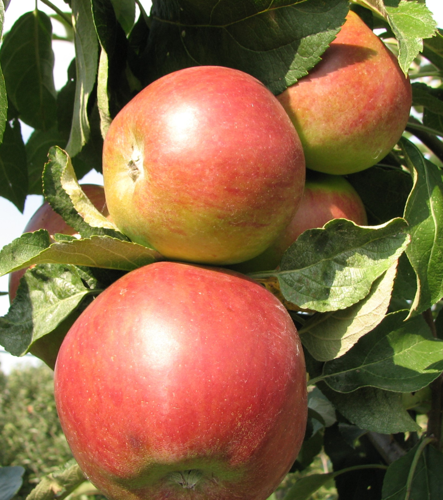"),
                    paste0("<b>Name: </b>", "Berkersheimer Roter "),
                    paste0("<b>Aussehen: </b>", "Mittelgroß, Fruchtfleisch grünlich fest"),
                    paste0("<b>Herkunft: </b>", "Frankfurt am Main-Berkersheim"),
                    paste0("<b>Geschmack: </b>", "Aromatisch, saftig"),
                    paste0("<b>Besonderheit: </b>", "Anspruchslos an Boden und Klima "),
                    paste0("<b>Verwendung: </b>", "Wirtschaftsapfel, Mostapfel"),
                    paste0("<a href='https://www.deutsche-genbank-obst.de/passport/index?width=2560&list=off&PassportCacheSearch%5Bart%5D=2&PassportCacheSearch%5Bleitname%5D=Berkersheimer+Roter&PassportCacheSearch%5Bpartner%5D=&PassportCacheSearch%5Bdgo%5D=&PassportCacheSearch%5Bursprungsland%5D=&PassportCacheSearch%5Berntereife%5D=&PassportCacheSearch%5Bgenussreife%5D=", "'>Quelle</a>"))

bischofsmuetze   <- paste(sep = "<br/>",
                    paste0("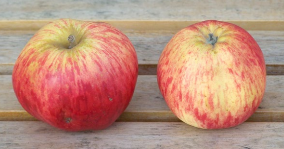"),
                    paste0("<b>Name: </b>", "Bischofsmütze "),
                    paste0("<b>Aussehen: </b>", "Mittelgroß bis groß, <br> Schale glatt und trocken, auffälig gerippt"),
                    paste0("<b>Herkunft: </b>", "Lokalsorte des Main-Kinzig-Kreises"),
                    paste0("<b>Geschmack: </b>", "Saftig, weinsäuerlich, leicht gewürzt"),
                    paste0("<b>Besonderheit: </b>", "Hoher Polyphenolgehalt, widerstandsfähig"),
                    paste0("<b>Verwendung: </b>", "--"),
                    paste0("<a href='https://www.pomologen-verein.de/media/user_upload/Landesgruppen/Hessen/Faltblatt_Lokalsorte_2023_Web.pdf", "'>Quelle</a>"))

brakeler   <- paste(sep = "<br/>",
                    paste0(""),
                    paste0("<b>Name: </b>", "Brakeler "),
                    paste0("<b>Aussehen: </b>", "Mittelgroß, Fruchtfleisch weiß"),
                    paste0("<b>Herkunft: </b>", "--"),
                    paste0("<b>Geschmack: </b>", "Süß"),
                    paste0("<b>Besonderheit: </b>", "--"),
                    paste0("<b>Verwendung: </b>", "--"),
                    paste0("<a href='https://www.deutsche-genbank-obst.de/passport/index?width=2560&list=off&PassportCacheSearch%5Bart%5D=2&PassportCacheSearch%5Bleitname%5D=brakeler&PassportCacheSearch%5Bpartner%5D=&PassportCacheSearch%5Bdgo%5D=&PassportCacheSearch%5Bursprungsland%5D=&PassportCacheSearch%5Berntereife%5D=&PassportCacheSearch%5Bgenussreife%5D=", "'>Quelle</a>"))

burgstaedter_roter   <- paste(sep = "<br/>",
                    paste0("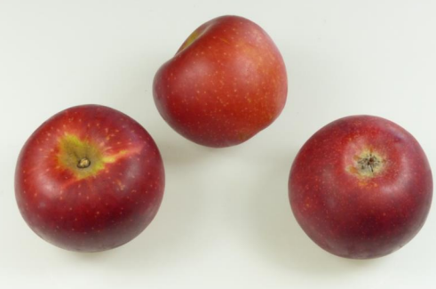"),
                    paste0("<b>Name: </b>", "Burgstädter Roter "),
                    paste0("<b>Aussehen: </b>", "Mittelgroß, Schale glatt und trocken, <br> Fruchtfleisch grünlich weiß, Stiel kurz"),
                    paste0("<b>Herkunft: </b>", "Unbekannt"),
                    paste0("<b>Geschmack: </b>", "Leicht säuerlich, ohne besonderes Aroma"),
                    paste0("<b>Besonderheit: </b>", "Sehr schwere Frucht, lagerfähig, <br> anspruchslos an Boden und Lage, schorffrei "),
                    paste0("<b>Verwendung: </b>", "Tafel- oder Wirtschaftsapfel"),
                    paste0("<a href='https://www.schlaraffenburger.de/cms/index.php/dokumente/sortenbeschreibungen/413-sorten-portrait-buergstaedter-roter/file", "'>Quelle</a>"))

ditzels_rosenapfel   <- paste(sep = "<br/>",
                    paste0(""),
                    paste0("<b>Name: </b>", "Ditzels Rosenapfel"),
                    paste0("<b>Aussehen: </b>", "Fruchtfleisch grün- bis gelblich-weiß, <br> glatt, glänzend"),
                    paste0("<b>Herkunft: </b>", "Hessische Lokalsorte, Eckartshausen, 1890"),
                    paste0("<b>Geschmack: </b>", "Saftreich,weinsäuerlich, <br> ohne besonders Aroma"),
                    paste0("<b>Besonderheit: </b>", "Anspruchslos an Boden und Klima, <br> bis in mittlere Höhenlagen anbaubar, <br> robust gegen Krebs und Schorf"),
                    paste0("<b>Verwendung: </b>", "Herstellung von Saft oder Apfelwein"),
                    paste0("<a href='https://www.pomologen-verein.de/media/user_upload/Landesgruppen/Faltblatt_Lokalsorte_2005.pdf", "'>Quelle</a>"," & <a href='https://shop.pomologen-verein.de/Obstsorten-regional/Erhaltenswerte-Obstsorten-fuer-Hessen?source=2&refertype=7&referid=124", "'>Quelle</a>"))

doppelter_prinzenapfel   <- paste(sep = "<br/>",
                    paste0("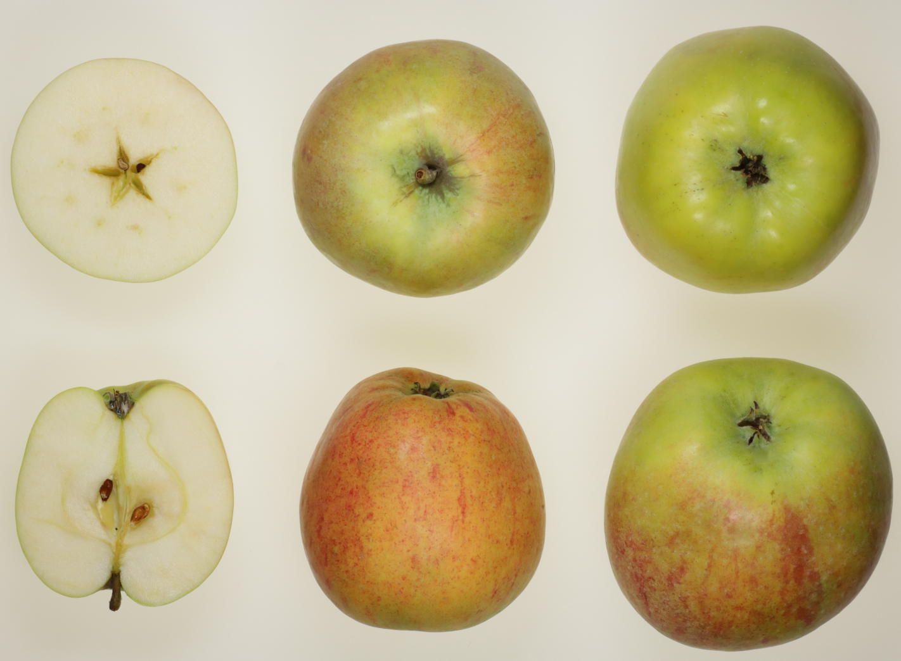"),
                    paste0("<b>Name: </b>", "Doppelter Prinzenapfel"),
                    paste0("<b>Aussehen: </b>", "Sehr groß "),
                    paste0("<b>Herkunft: </b>", "Norddeutschland"),
                    paste0("<b>Geschmack: </b>", "Süßsäuerlich, erfrischend aromatisch, saftig"),
                    paste0("<b>Besonderheit: </b>", "Nur für kurze Zeit haltbar, <br> etwas Krebsanfällig, nicht sehr windfest, <br> benötigt nährstoffreichen Boden"),
                    paste0("<b>Verwendung: </b>", "Tafelapfel"),
                    paste0("<a href='https://www.deutsche-genbank-obst.de/passport/index?width=2560&list=off&PassportCacheSearch%5Bart%5D=2&PassportCacheSearch%5Bleitname%5D=doppelter+prinzenapfel&PassportCacheSearch%5Bpartner%5D=&PassportCacheSearch%5Bdgo%5D=&PassportCacheSearch%5Bursprungsland%5D=&PassportCacheSearch%5Berntereife%5D=&PassportCacheSearch%5Bgenussreife%5D=", "'>Quelle</a>"," & <a href='https://shop.pomologen-verein.de/Obstsorten-regional/Erhaltenswerte-Obstsorten-fuer-Hessen?source=2&refertype=7&referid=124", "'>Quelle</a>"))

dorheimer_streifling   <- paste(sep = "<br/>",
                    paste0(""),
                    paste0("<b>Name: </b>", "Dorheimer Streifling"),
                    paste0("<b>Aussehen: </b>", "Glatt, trocken, leicht fettig, <br> Fruchtfleisch gelblich weiß"),
                    paste0("<b>Herkunft: </b>", "Lokalsorte der Wetterau, vor 1950"),
                    paste0("<b>Geschmack: </b>", "Saftig, gut gewürzt, duftend"),
                    paste0("<b>Besonderheit: </b>", "Robust und widerstandsfähig, <br> keine Anfälligkeit zu Krankheiten"),
                    paste0("<b>Verwendung: </b>", "Tafel- oder Wirtschaftsapfel vor allem zur Herstellung von Saft, Mus und Obstsalat geeignet"),
                    paste0("<a href='https://www.pomologen-verein.de/media/user_upload/Landesgruppen/Faltblatt_Lokalsorte_2009.pdf", "'>Quelle</a>"))

freinsheimer_taffetapfel    <- paste(sep = "<br/>",
                    paste0(""),
                    paste0("<b>Name: </b>", "Freinsheimer Taffetapfel "),
                    paste0("<b>Aussehen: </b>", "Mittelgroß, glatt, Fruchtfleisch gelblich"),
                    paste0("<b>Herkunft: </b>", "Lokalsorte aus Freinsheim Pfalz"),
                    paste0("<b>Geschmack: </b>", "Süß, saftig"),
                    paste0("<b>Besonderheit: </b>", "Sehr starker Wuchs, <br> robust speziell gegen Schorf"),
                    paste0("<b>Verwendung: </b>", "--"),
                    paste0("<a href='https://shop.pomologen-verein.de/Kultur-und-Geschichte/Pfaelzer-Obstkultur?source=2&refertype=7&referid=60", "'>Quelle</a>"))

freudenberger_nuetzerling    <- paste(sep = "<br/>",
                    paste0("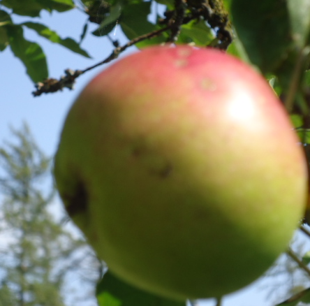"),
                    paste0("<b>Name: </b>", "Freudenberger Nützerling "),
                    paste0("<b>Aussehen: </b>", "Mittelgroß"),
                    paste0("<b>Herkunft: </b>", "Baltikum"),
                    paste0("<b>Geschmack: </b>", "Angenehm süß-säuerlich"),
                    paste0("<b>Besonderheit: </b>", "Robust und widerstandsfähig, gut lagerbar"),
                    paste0("<b>Verwendung: </b>", "Wirtschaftsapfel"),
                    paste0("<a href='https://www.deutsche-genbank-obst.de/passport/index?width=2560&list=off&PassportCacheSearch%5Bart%5D=2&PassportCacheSearch%5Bleitname%5D=freudenberger&PassportCacheSearch%5Bpartner%5D=&PassportCacheSearch%5Bdgo%5D=&PassportCacheSearch%5Bursprungsland%5D=&PassportCacheSearch%5Berntereife%5D=&PassportCacheSearch%5Bgenussreife%5D=", "'>Quelle</a>"))

gacksapfel    <- paste(sep = "<br/>",
                    paste0("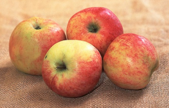"),
                    paste0("<b>Name: </b>", "Gacksapfel "),
                    paste0("<b>Aussehen: </b>", "Form sehr variabel, mittelgroß, <br> glatt, Fruchtfleisch grün bis gelblich weiß"),
                    paste0("<b>Herkunft: </b>", "Lokalsorte aus Aßlar-Berghausen an der Dill, um 1870"),
                    paste0("<b>Geschmack: </b>", "Sehr saftig, wenig aromatisch"),
                    paste0("<b>Besonderheit: </b>", "Anspruchslos an Boden und Klima, <br> robust und widerstandsfähig vor allem gegen Schorf"),
                    paste0("<b>Verwendung: </b>", "Wirtschaftsapfel zur Herstellung von Saft oder Wein"),
                    paste0("<a href='https://www.pomologen-verein.de/media/user_upload/Landesgruppen/Faltblatt_Lokalsorte_2006.pdf", "'>Quelle</a>"))

hartapfel <- paste(sep = "<br/>",
                    paste0("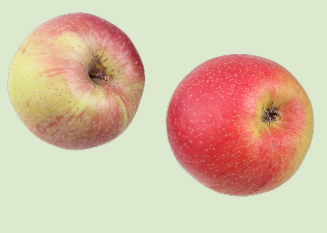"),
                    paste0("<b>Name: </b>", "Hartapfel (Eckbepler)"),
                    paste0("<b>Aussehen: </b>", "Mittelgroß bis groß, Form Variabel, <br> glatte Schale die teils fettig ist, Fruchtfleisch gelb"),
                    paste0("<b>Herkunft: </b>", "unbekannt, vmtl. Lokalsorte des Kreises Wetzlar"),
                    paste0("<b>Geschmack: </b>", "Saftig, mäßig aromatisch"),
                    paste0("<b>Besonderheit: </b>", "Frosthart, widerstandsfähig gegen Schorf, soll auf schweren Böden angebaut werden, <br> sehr fruchtbar"),
                    paste0("<b>Verwendung: </b>", "Wirtschaftsapfel zur Herstellung von Saft oder Wein"),
                    paste0("<a href='https://www.pomologen-verein.de/media/user_upload/Landesgruppen/Faltblatt_Lokalsorte_2017.pdf", "'>Quelle</a>"))

heimeldinger    <- paste(sep = "<br/>",
                    paste0(""),
                    paste0("<b>Name: </b>", "Heimeldinger"),
                    paste0("<b>Aussehen: </b>", "Klein, Fruchtfleisch grünlich, kurzer Stiel,"),
                    paste0("<b>Herkunft: </b>", "--"),
                    paste0("<b>Geschmack: </b>", "Süßsäuerlich, mäßig saftig"),
                    paste0("<b>Besonderheit: </b>", "--"),
                    paste0("<b>Verwendung: </b>", "Tafelapfel, Wirtschaftsapfel"),
                    paste0("<a href='https://shop.pomologen-verein.de/Kultur-und-Geschichte/Pfaelzer-Obstkultur?source=2&refertype=7&referid=60", "'>Quelle</a>"))

herrgottsapfel    <- paste(sep = "<br/>",
                    paste0(""),
                    paste0("<b>Name: </b>", "Herrgottsapfel"),
                    paste0("<b>Aussehen: </b>", "Mittelgroß, weiches Fleisch"),
                    paste0("<b>Herkunft: </b>", "Erstmals 1539 erwähnt, alte Westpfälzer Obstsorte"),
                    paste0("<b>Geschmack: </b>", "Süßsäuerlich"),
                    paste0("<b>Besonderheit: </b>", "Starker Wuchs, lagerfähig"),
                    paste0("<b>Verwendung: </b>", "Tafel- und Küchenapfel"),
                    paste0("<a href='https://shop.pomologen-verein.de/Kultur-und-Geschichte/Pfaelzer-Obstkultur?source=2&refertype=7&referid=60", "'>Quelle</a>"))

heuchelheimer_schneeapfel    <- paste(sep = "<br/>",
                    paste0("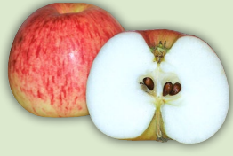"),
                    paste0("<b>Name: </b>", "Heuchelheimer Schneeapfel"),
                    paste0("<b>Aussehen: </b>", "Kugelig, glatt, glänzend, Fruchtfleisch weiß"),
                    paste0("<b>Herkunft: </b>", "Lokalsorte aus Heuchelheim, 19. Jahrhundert"),
                    paste0("<b>Geschmack: </b>", "Leicht säuerlich, aromatisch, saftig, schwacher Duft"),
                    paste0("<b>Besonderheit: </b>", "Anspruchslos an Boden und Klima, <br> frosthart, wenig schorfanfällig"),
                    paste0("<b>Verwendung: </b>", "Tafelobst oder Wirtschaftsapfel, <br> speziell für Obstsalat, säfte und Weine"),
                    paste0("<a href='https://www.pomologen-verein.de/media/user_upload/Landesgruppen/Faltblatt_Lokalsorte_2003.pdf", "'>Quelle</a>"))

himbacher_gruener    <- paste(sep = "<br/>",
                    paste0(""),
                    paste0("<b>Name: </b>", "Himbacher Grüner"),
                    paste0("<b>Aussehen: </b>", "Groß, festes Fruchtfleisch"),
                    paste0("<b>Herkunft: </b>", "Himbach, Kreis Büdingen, Hessen"),
                    paste0("<b>Geschmack: </b>", "Saftig mit vorherrschender Säure"),
                    paste0("<b>Besonderheit: </b>", "Heringe Ansprüche an Boden und Klima, Windfest"),
                    paste0("<b>Verwendung: </b>", "Mostapfel, teils als Tafelapfel"),
                    paste0("<a href='https://www.deutsche-genbank-obst.de/passport/index?width=2560&list=off&PassportCacheSearch%5Bart%5D=2&PassportCacheSearch%5Bleitname%5D=himbacher&PassportCacheSearch%5Bpartner%5D=&PassportCacheSearch%5Bdgo%5D=&PassportCacheSearch%5Bursprungsland%5D=&PassportCacheSearch%5Berntereife%5D=&PassportCacheSearch%5Bgenussreife%5D=", "'>Quelle</a>"))

hochzeitsapfel     <- paste(sep = "<br/>",
                    paste0("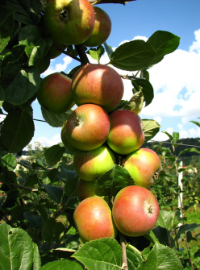"),
                    paste0("<b>Name: </b>", "Hochzeitsapfel"),
                    paste0("<b>Aussehen: </b>", "Mittelgroß bis groß, Fruchtfleisch gelb,"),
                    paste0("<b>Herkunft: </b>", "Ostanglien (England)"),
                    paste0("<b>Geschmack: </b>", "Süß-säuerlich, saftig"),
                    paste0("<b>Besonderheit: </b>", "Anspruchslos und robust, sehr widerstandsfähig, kaum Schorfanfällig"),
                    paste0("<b>Verwendung: </b>", "Tafelapfel"),
                    paste0("<a href='https://www.deutsche-genbank-obst.de/passport/index?width=2560&list=off&PassportCacheSearch%5Bart%5D=2&PassportCacheSearch%5Bleitname%5D=Hochzeitsapfel&PassportCacheSearch%5Bpartner%5D=&PassportCacheSearch%5Bdgo%5D=&PassportCacheSearch%5Bursprungsland%5D=&PassportCacheSearch%5Berntereife%5D=&PassportCacheSearch%5Bgenussreife%5D=", "'>Quelle</a>"," & <a href='https://shop.pomologen-verein.de/Obstsorten-regional/Erhaltenswerte-Obstsorten-fuer-Hessen?source=2&refertype=7&referid=124", "'>Quelle</a>"))

jakob_fischer    <- paste(sep = "<br/>",
                    paste0("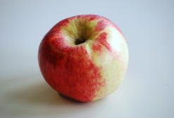"),
                    paste0("<b>Name: </b>", "Jakob Fischer"),
                    paste0("<b>Aussehen: </b>", "Groß, Fruchtfleisch weiß, "),
                    paste0("<b>Herkunft: </b>", "Kreis Biberach"),
                    paste0("<b>Geschmack: </b>", "Süßsäuerlich, saftig, aromatisch"),
                    paste0("<b>Besonderheit: </b>", "Sehr robust, nur kurz haltbar, starkwüchsig"),
                    paste0("<b>Verwendung: </b>", "Tafelapfel, teils Mostapfel"),
                    paste0("<a href='https://shop.pomologen-verein.de/Obstsorten-regional/Alte-Obstsorten-neu-entdeckt-fuer-Niedersachsen%E2%80%93Bremen?source=2&refertype=7&referid=280", "'>Quelle</a>"))

kaesapfel    <- paste(sep = "<br/>",
                    paste0(""),
                    paste0("<b>Name: </b>", "Käsapfel"),
                    paste0("<b>Aussehen: </b>", "Mittelgroß, Fruchtfleisch weiß"),
                    paste0("<b>Herkunft: </b>", "Lokalsorte aus dem nördlichen Teil der Rhön"),
                    paste0("<b>Geschmack: </b>", "Saftig, guter Geschmack"),
                    paste0("<b>Besonderheit: </b>", "Benötigt gute Böden"),
                    paste0("<b>Verwendung: </b>", "Tafelapfel, Wirtschaftsapfel"),
                    paste0("<a href='https://www.deutsche-genbank-obst.de/passport/index?width=2560&list=off&PassportCacheSearch%5Bart%5D=2&PassportCacheSearch%5Bleitname%5D=K%C3%A4sapfel&PassportCacheSearch%5Bpartner%5D=&PassportCacheSearch%5Bdgo%5D=&PassportCacheSearch%5Bursprungsland%5D=&PassportCacheSearch%5Berntereife%5D=&PassportCacheSearch%5Bgenussreife%5D=", "'>Quelle</a>"))

kloppenheimer_streifling    <- paste(sep = "<br/>",
                    paste0(""),
                    paste0("<b>Name: </b>", "Kloppenheimer Streifling "),
                    paste0("<b>Aussehen: </b>", "Fruchtfleisch weiß, Mittelgroß, glatt, glänzend"),
                    paste0("<b>Herkunft: </b>", "Vmtl. um Wiesbaden"),
                    paste0("<b>Geschmack: </b>", "Saftig und mit angenehmer Säure, <br> nach längerer Lagerung süßlich"),
                    paste0("<b>Besonderheit: </b>", "Starkwüchsig, widerstandsfähig"),
                    paste0("<b>Verwendung: </b>", "Wirtschaftsapfel für Saft und Wein, Dörrobst"),
                    paste0("<a href='https://www.pomologen-verein.de/media/user_upload/Landesgruppen/Faltblatt_Lokalsorte_2007.pdf", "'>Quelle</a>"))

korbacher_edelrenette     <- paste(sep = "<br/>",
                    paste0(""),
                    paste0("<b>Name: </b>", "Korbacher Edelrenette"),
                    paste0("<b>Aussehen: </b>", "Mittelgroß, keine Deckfarbe"),
                    paste0("<b>Herkunft: </b>", "--"),
                    paste0("<b>Geschmack: </b>", "Süß, aromatisch"),
                    paste0("<b>Besonderheit: </b>", "Robust, anspruchslos"),
                    paste0("<b>Verwendung: </b>", "Tafelapfel"),
                    paste0("<a href='https://www.deutsche-genbank-obst.de/passport/index?width=2543&list=off&PassportCacheSearch%5Bart%5D=2&PassportCacheSearch%5Bleitname%5D=Korbacher&PassportCacheSearch%5Bpartner%5D=&PassportCacheSearch%5Bdgo%5D=&PassportCacheSearch%5Bursprungsland%5D=&PassportCacheSearch%5Berntereife%5D=&PassportCacheSearch%5Bgenussreife%5D=", "'>Quelle</a>"," & <a href='https://shop.pomologen-verein.de/Obstsorten-regional/Erhaltenswerte-Obstsorten-fuer-Hessen?source=2&refertype=7&referid=124", "'>Quelle</a>"))

koerler_edelapfel     <- paste(sep = "<br/>",
                    paste0("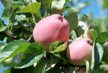"),
                    paste0("<b>Name: </b>", "Koerler Edelapfel"),
                    paste0("<b>Aussehen: </b>", "Glockenförmig, gestreift, glatt, <br> fettig, Fruchtfleisch weißgelb"),
                    paste0("<b>Herkunft: </b>", "Vmtl. aus Norditalien"),
                    paste0("<b>Geschmack: </b>", "Sehr wohlschmeckend, saftig, Vanillearoma, süß"),
                    paste0("<b>Besonderheit: </b>", "Benötigt feuchte Standorte <br>und gute Böden, leicht anfällig bei Schorf"),
                    paste0("<b>Verwendung: </b>", "Tafelapfel und zur Saft und Weinherstellung"),
                    paste0("<a href='https://www.pomologen-verein.de/media/user_upload/Landesgruppen/Faltblatt_Lokalsorte_2004.pdf", "'>Quelle</a>"))

kumpfenapfel    <- paste(sep = "<br/>",
                    paste0(""),
                    paste0("<b>Name: </b>", "Kumpfenapfel"),
                    paste0("<b>Aussehen: </b>", "s. Abb."),
                    paste0("<b>Herkunft: </b>", "Lokalsorte aus Baden"),
                    paste0("<b>Geschmack: </b>", "Sehr saftig"),
                    paste0("<b>Besonderheit: </b>", "Anspruchslos an Klima und Boden"),
                    paste0("<b>Verwendung: </b>", "Wirtschaftsapfel, Mostapfel"),
                    paste0("<a href='https://www.deutsche-genbank-obst.de/passport/index?width=2560&list=off&PassportCacheSearch%5Bart%5D=2&PassportCacheSearch%5Bleitname%5D=Kumpfenapfel&PassportCacheSearch%5Bpartner%5D=&PassportCacheSearch%5Bdgo%5D=&PassportCacheSearch%5Bursprungsland%5D=&PassportCacheSearch%5Berntereife%5D=&PassportCacheSearch%5Bgenussreife%5D=", "'>Quelle</a>"))

lautertaler_waldapfel    <- paste(sep = "<br/>",
                    paste0("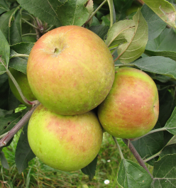"),
                    paste0("<b>Name: </b>", "Lautertaler Waldapfel"),
                    paste0("<b>Aussehen: </b>", "Klein"),
                    paste0("<b>Herkunft: </b>", "Lautertal"),
                    paste0("<b>Geschmack: </b>", "Süßlich, kaum Säure"),
                    paste0("<b>Besonderheit: </b>", "--"),
                    paste0("<b>Verwendung: </b>", "Tafelapfel, Wirtschaftsapfel, Mostapfel"),
                    paste0("<a href='https://www.deutsche-genbank-obst.de/passport/index?width=2560&list=off&PassportCacheSearch%5Bart%5D=2&PassportCacheSearch%5Bleitname%5D=lautertaler+waldapfel&PassportCacheSearch%5Bpartner%5D=&PassportCacheSearch%5Bdgo%5D=&PassportCacheSearch%5Bursprungsland%5D=&PassportCacheSearch%5Berntereife%5D=&PassportCacheSearch%5Bgenussreife%5D=", "'>Quelle</a>"))

lohrer_rambur    <- paste(sep = "<br/>",
                    paste0(""),
                    paste0("<b>Name: </b>", "Lohrer Rambur"),
                    paste0("<b>Aussehen: </b>", "Groß, Fruchtfleisch grün"),
                    paste0("<b>Herkunft: </b>", "Schwaikheim bei Waiblingen"),
                    paste0("<b>Geschmack: </b>", " Milde Säure, wenig süß, sehr saftig"),
                    paste0("<b>Besonderheit: </b>", "Anspruchslos, widerstandsfähig und robust gegen Krankheiten"),
                    paste0("<b>Verwendung: </b>", "Tafel-, Most- oder Wirtschaftsapfel, Keltersorte, Brennfrucht"),
                    paste0("<a href='https://www.deutsche-genbank-obst.de/passport/index?width=1791&list=off&PassportCacheSearch%5Bart%5D=2&PassportCacheSearch%5Bleitname%5D=Lohrer+Rambur&PassportCacheSearch%5Bpartner%5D=&PassportCacheSearch%5Bdgo%5D=&PassportCacheSearch%5Bursprungsland%5D=&PassportCacheSearch%5Berntereife%5D=&PassportCacheSearch%5Bgenussreife%5D=", "'>Quelle</a>"," & <a href='https://shop.pomologen-verein.de/Obstsorten-regional/Erhaltenswerte-Obstsorten-fuer-Hessen?source=2&refertype=7&referid=124", "'>Quelle</a>"))

metzrenette    <- paste(sep = "<br/>",
                    paste0("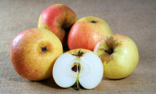"),
                    paste0("<b>Name: </b>", "Metzrenette"),
                    paste0("<b>Aussehen: </b>", "Mittelgroß, glatt, leicht glänzend, Fruchtfleisch hellgelb"),
                    paste0("<b>Herkunft: </b>", "Lokalsorte aus Wabern, um 1780"),
                    paste0("<b>Geschmack: </b>", "Saftig, gewürzt, edles Aroma"),
                    paste0("<b>Besonderheit: </b>", "Starker Wuchs, anspruchslos, <br> an schlechten Standorten leicht Krebs und Schorf anfällig"),
                    paste0("<b>Verwendung: </b>", "Tafelapfel"),
                    paste0("<a href='https://www.pomologen-verein.de/media/user_upload/Landesgruppen/Faltblatt_Lokalsorte_2011.pdf", "'>Quelle</a>"))

moringer_rosenapfel    <- paste(sep = "<br/>",
                    paste0(""),
                    paste0("<b>Name: </b>", "Moringer Rosenapfel"),
                    paste0("<b>Aussehen: </b>", "Groß, Fruchtfleisch weiß"),
                    paste0("<b>Herkunft: </b>", "Moringen"),
                    paste0("<b>Geschmack: </b>", "Süßsäuerlich saftig"),
                    paste0("<b>Besonderheit: </b>", "Schöne Frühherbstsorte, robust, windfest, nicht auf zu nassen Böden anpflanzbar"),
                    paste0("<b>Verwendung: </b>", "Tafelapfel, Mostapfel"),
                    paste0("<a href='https://www.deutsche-genbank-obst.de/passport/index?width=1791&list=off&PassportCacheSearch%5Bart%5D=2&PassportCacheSearch%5Bleitname%5D=Moringer+Rosenapfel&PassportCacheSearch%5Bpartner%5D=&PassportCacheSearch%5Bdgo%5D=&PassportCacheSearch%5Bursprungsland%5D=&PassportCacheSearch%5Berntereife%5D=&PassportCacheSearch%5Bgenussreife%5D=", "'>Quelle</a>"," & <a href='https://shop.pomologen-verein.de/Obstsorten-regional/Alte-Obstsorten-neu-entdeckt-fuer-Niedersachsen%E2%80%93Bremen?source=2&refertype=7&referid=280", "'>Quelle</a>"))
```

```{r echo=FALSE}
notarisapfel    <- paste(sep = "<br/>",
                    paste0("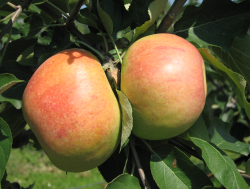"),
                    paste0("<b>Name: </b>", "Notarisapfel"),
                    paste0("<b>Aussehen: </b>", "Mittel- bis groß, Fruchtfleisch gelb"),
                    paste0("<b>Herkunft: </b>", "Lunteren (NLD)"),
                    paste0("<b>Geschmack: </b>", "Saftig, aromatisch süß, feine Säure"),
                    paste0("<b>Besonderheit: </b>", "Anbau auf trockenen Böden"),
                    paste0("<b>Verwendung: </b>", "Tafelapfel, Wirtschaftsapfel, Mostapfel"),
                    paste0("<a href='hhttps://www.deutsche-genbank-obst.de/passport/index?width=2560&list=off&PassportCacheSearch%5Bart%5D=2&PassportCacheSearch%5Bleitname%5D=Notarisapfel&PassportCacheSearch%5Bpartner%5D=&PassportCacheSearch%5Bdgo%5D=&PassportCacheSearch%5Bursprungsland%5D=&PassportCacheSearch%5Berntereife%5D=&PassportCacheSearch%5Bgenussreife%5D=", "'>Quelle</a>"))

pflankenapfel    <- paste(sep = "<br/>",
                    paste0("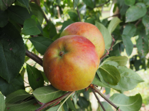"),
                    paste0("<b>Name: </b>", "Pflankenapfel"),
                    paste0("<b>Aussehen: </b>", "Mittelgroß, Fruchtfleisch gelb"),
                    paste0("<b>Herkunft: </b>", "--"),
                    paste0("<b>Geschmack: </b>", "Saftig, gewürzt, <br> leichte Säure bei hohem Zuckergehalt"),
                    paste0("<b>Besonderheit: </b>", "--"),
                    paste0("<b>Verwendung: </b>", "Tafelapfel, Wirtschaftsapfel"),
                    paste0("<a href='https://www.deutsche-genbank-obst.de/passport/index?width=2560&list=off&PassportCacheSearch%5Bart%5D=2&PassportCacheSearch%5Bleitname%5D=Pflankenapfel&PassportCacheSearch%5Bpartner%5D=&PassportCacheSearch%5Bdgo%5D=&PassportCacheSearch%5Bursprungsland%5D=&PassportCacheSearch%5Berntereife%5D=&PassportCacheSearch%5Bgenussreife%5D=", "'>Quelle</a>"))

reders_goldrenette    <- paste(sep = "<br/>",
                    paste0("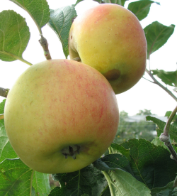"),
                    paste0("<b>Name: </b>", "Reders Goldrenette"),
                    paste0("<b>Aussehen: </b>", "Mittelgroß, glatt, Fruchtfleisch weiß"),
                    paste0("<b>Herkunft: </b>", "--"),
                    paste0("<b>Geschmack: </b>", "Saftig, gewürzt"),
                    paste0("<b>Besonderheit: </b>", "Wenig anspruchsvoll an Boden und Klima"),
                    paste0("<b>Verwendung: </b>", "Tafelapfel"),
                    paste0("<a href='https://www.deutsche-genbank-obst.de/passport/index?width=2560&list=off&PassportCacheSearch%5Bart%5D=2&PassportCacheSearch%5Bleitname%5D=Reders+Goldrenette&PassportCacheSearch%5Bpartner%5D=&PassportCacheSearch%5Bdgo%5D=&PassportCacheSearch%5Bursprungsland%5D=&PassportCacheSearch%5Berntereife%5D=&PassportCacheSearch%5Bgenussreife%5D=", "'>Quelle</a>"))

roter_augustiner    <- paste(sep = "<br/>",
                    paste0(""),
                    paste0("<b>Name: </b>", "Roter Augustiner"),
                    paste0("<b>Aussehen: </b>", "Mittel- bis groß, kantig, Schale matt mit silbrigen Bereichen"),
                    paste0("<b>Herkunft: </b>", "Vmtl. aus Lothringen, 1760"),
                    paste0("<b>Geschmack: </b>", "Guter säuerlich-süßer Geschmack,"),
                    paste0("<b>Besonderheit: </b>", "Starker Wuchs,"),
                    paste0("<b>Verwendung: </b>", "Tafelapfel, Wirtschaftsapfel"),
                    paste0("<a href='https://shop.pomologen-verein.de/Kultur-und-Geschichte/Pfaelzer-Obstkultur?source=2&refertype=7&referid=60", "'>Quelle</a>"))

ruhm_von_kelsterbach    <- paste(sep = "<br/>",
                    paste0("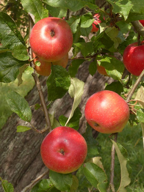"),
                    paste0("<b>Name: </b>", "Ruhm von Kelsterbach"),
                    paste0("<b>Aussehen: </b>", "Ungleichmäßig rund, glatt, glänzend, Fruchtfleisch weiß"),
                    paste0("<b>Herkunft: </b>", "Aus Kelsterbach, um 1900"),
                    paste0("<b>Geschmack: </b>", "Süß-sauer, leicht gewürzt, aromatisch"),
                    paste0("<b>Besonderheit: </b>", "Anspruchslos, Wiederstandsfähig vor allem gegen Schorf"),
                    paste0("<b>Verwendung: </b>", "Tafel- und Wirtschaftsapfel, <br> speziell für Saft oder Apfelwein geeignet"),
                    paste0("<a href='https://www.pomologen-verein.de/media/user_upload/Landesgruppen/Faltblatt_Lokalsorte_2018.pdf", "'>Quelle</a>"))

schoener_von_miltenberg    <- paste(sep = "<br/>",
                    paste0(""),
                    paste0("<b>Name: </b>", "Schöner von Miltenberg"),
                    paste0("<b>Aussehen: </b>", "Mittelgroß bis groß, <br> Fruchtfleisch cremefarbig"),
                    paste0("<b>Herkunft: </b>", "Lokalsorte aus Miltenberg am Main"),
                    paste0("<b>Geschmack: </b>", "Saftig, schwachsäuerlich, wenig Aroma"),
                    paste0("<b>Besonderheit: </b>", "Widerstandsfähig gegen Schädlinge und Krankheiten, nicht auf trockenen Böden anbauen"),
                    paste0("<b>Verwendung: </b>", "Wirtschaftsapfel, Mostapfe"),
                    paste0("<a href='https://www.deutsche-genbank-obst.de/passport/index?width=2560&list=off&PassportCacheSearch%5Bart%5D=2&PassportCacheSearch%5Bleitname%5D=Sch%C3%B6ner+von+Miltenberg&PassportCacheSearch%5Bpartner%5D=&PassportCacheSearch%5Bdgo%5D=&PassportCacheSearch%5Bursprungsland%5D=&PassportCacheSearch%5Berntereife%5D=&PassportCacheSearch%5Bgenussreife%5D=", "'>Quelle</a>"))

schoener_von_nordhausen    <- paste(sep = "<br/>",
                    paste0(""),
                    paste0("<b>Name: </b>", "Schöner von Nordhausen"),
                    paste0("<b>Aussehen: </b>", "s. Abb."),
                    paste0("<b>Herkunft: </b>", "Aus Thüringen, 1866"),
                    paste0("<b>Geschmack: </b>", "(Süß-)säuerlich, saftig, aromatisch"),
                    paste0("<b>Besonderheit: </b>", "Etwas schorfanfällig"),
                    paste0("<b>Verwendung: </b>", "Tafel-, Wirtschafts- und Mostapfel"),
                    paste0("<a href='https://shop.pomologen-verein.de/Obstsorten-regional/Alte-Obstsorten-neu-entdeckt-fuer-Niedersachsen%E2%80%93Bremen?source=2&refertype=7&referid=280", "'>Quelle</a>"))

schwarzschillernder_kohlapfel    <- paste(sep = "<br/>",
                                          paste0("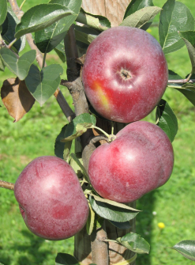"),
                                          paste0("<b>Name: </b>", "Schwarzschillernder Kohlapfel"),
                                          paste0("<b>Aussehen: </b>", "Klein- bis mittelgroß, Fruchtfleisch fein"),
                                          paste0("<b>Herkunft: </b>", "Alte Lokalsorte der Vorderpfalz"),
                                          paste0("<b>Geschmack: </b>", "Saftig, leicht säuerlich"),
                                          paste0("<b>Besonderheit: </b>", "--"),
                                          paste0("<b>Verwendung: </b>", "Wirtschaftsapfel, Mostapfel"),
                                          paste0("<a href='https://www.deutsche-genbank-obst.de/passport/index?width=1920&list=off&PassportCacheSearch%5Bart%5D=2&PassportCacheSearch%5Bleitname%5D=Schwarzschillernder+Kohlapfel&PassportCacheSearch%5Bpartner%5D=&PassportCacheSearch%5Bdgo%5D=&PassportCacheSearch%5Bursprungsland%5D=&PassportCacheSearch%5Berntereife%5D=&PassportCacheSearch%5Bgenussreife%5D=", "'>Quelle</a>"))

siebenschlaefer    <- paste(sep = "<br/>",
                            paste0("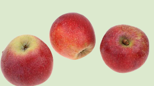"),
                            paste0("<b>Name: </b>", "Siebenschläfer"),
                            paste0("<b>Aussehen: </b>", "Kegelförmig, mittelgroß, <br> glatt, Fruchtfleisch grüngelblich"),
                            paste0("<b>Herkunft: </b>", "Lokalsorte Lahn-Dill-Kreis"),
                            paste0("<b>Geschmack: </b>", "Saftig, mildsauer, süßlich, duftend"),
                            paste0("<b>Besonderheit: </b>", "Anspruchslos an Boden und Klima, <br> sehr widerstandsfähig gegen Pilzkrankheiten"),
                            paste0("<b>Verwendung: </b>", "Wirtschaftsapfel, Tafelapfel"),
                            paste0("<a href='https://www.pomologen-verein.de/media/user_upload/Landesgruppen/Faltblatt_Lokalsorte_2013.pdf", "'>Quelle</a>"))

sossenheimer_roter    <- paste(sep = "<br/>",
                               paste0(""),
                               paste0("<b>Name: </b>", "Sossenheimer Roter"),
                               paste0("<b>Aussehen: </b>", "Mittelgroß, leuchtend rot, "),
                               paste0("<b>Herkunft: </b>", "--"),
                               paste0("<b>Geschmack: </b>", "Saftig, süßsäuerlich"),
                               paste0("<b>Besonderheit: </b>", "--"),
                               paste0("<b>Verwendung: </b>", "Tafelapfel, Wirtschaftsapfel"),
                               paste0("<a href='https://www.deutsche-genbank-obst.de/passport/index?width=1920&list=off&PassportCacheSearch%5Bart%5D=2&PassportCacheSearch%5Bleitname%5D=Sossenheimer+Roter&PassportCacheSearch%5Bpartner%5D=&PassportCacheSearch%5Bdgo%5D=&PassportCacheSearch%5Bursprungsland%5D=&PassportCacheSearch%5Berntereife%5D=&PassportCacheSearch%5Bgenussreife%5D=", "'>Quelle</a>"))

spitzrabau    <- paste(sep = "<br/>",
                       paste0(""),
                       paste0("<b>Name: </b>", "Spitzrabau"),
                       paste0("<b>Aussehen: </b>", "Ungleichhälftig, Fruchtfleisch grün bis gelblich-weiß, Glatt, teils rau"),
                       paste0("<b>Herkunft: </b>", "Lokalsorte aus dem Odenwald"),
                       paste0("<b>Geschmack: </b>", "Süß-säuerlich, ohne besonderes Aroma"),
                       paste0("<b>Besonderheit: </b>", "Anspruchslos an boden und klima, widerstandsfähig, kann sehr alte werden"),
                       paste0("<b>Verwendung: </b>", "Guter Wirtschaftsapfel speziell für backen und zur Apfelwein Herstellung  geeignet"),
                       paste0("<a href='https://www.pomologen-verein.de/media/user_upload/Landesgruppen/Faltblatt_Lokalsorte_2012.pdf", "'>Quelle</a>"))


steinbacher    <- paste(sep = "<br/>",
                        paste0(""),
                        paste0("<b>Name: </b>", "Steinbacher"),
                        paste0("<b>Aussehen: </b>", "Klein, Fruchtfleisch weiß"),
                        paste0("<b>Herkunft: </b>", "Ende des 19.Jh. in Unterfranken enstanden"),
                        paste0("<b>Geschmack: </b>", "Würzig"),
                        paste0("<b>Besonderheit: </b>", "Relativ anspruchslos, <br> kaum anfällig für Pilzbefahl"),
                        paste0("<b>Verwendung: </b>", "Tafel- und Mostapfel"),
                        paste0("<a href='https://www.deutsche-genbank-obst.de/passport/index?width=1903&list=off&PassportCacheSearch%5Bart%5D=2&PassportCacheSearch%5Bleitname%5D=Steinbacher&PassportCacheSearch%5Bpartner%5D=&PassportCacheSearch%5Bdgo%5D=&PassportCacheSearch%5Bursprungsland%5D=&PassportCacheSearch%5Berntereife%5D=&PassportCacheSearch%5Bgenussreife%5D=", "'>Quelle</a>"," & <a href='https://shop.pomologen-verein.de/Obstsorten-regional/Erhaltenswerte-Obstsorten-fuer-Hessen?source=2&refertype=7&referid=124", "'>Quelle</a>"))

tannenkrueger    <- paste(sep = "<br/>",
                          paste0(""),
                          paste0("<b>Name: </b>", "Tannenkrüger"),
                          paste0("<b>Aussehen: </b>", "Mittelgroß, Fruchtfleisch cremefarbend"),
                          paste0("<b>Herkunft: </b>", "Hof Tannenkrug in Leopoldshöhe (bei Bielefeld)"),
                          paste0("<b>Geschmack: </b>", "Süßsäuerlich, schwach aromatisch, saftig"),
                          paste0("<b>Besonderheit: </b>", "--"),
                          paste0("<b>Verwendung: </b>", "Tafelapfel, Wirtschaftsapfel"),
                          paste0("<a href='https://www.deutsche-genbank-obst.de/passport/index?width=1920&list=off&PassportCacheSearch%5Bart%5D=2&PassportCacheSearch%5Bleitname%5D=Tannenkr%C3%BCger&PassportCacheSearch%5Bpartner%5D=&PassportCacheSearch%5Bdgo%5D=&PassportCacheSearch%5Bursprungsland%5D=&PassportCacheSearch%5Berntereife%5D=&PassportCacheSearch%5Bgenussreife%5D=", "'>Quelle</a>"))

tiefenbluete    <- paste(sep = "<br/>",
                         paste0(""),
                         paste0("<b>Name: </b>", "Tiefenbluete"),
                         paste0("<b>Aussehen: </b>", "s. Abb."),
                         paste0("<b>Herkunft: </b>", "Lippoldsberg (Oberweser)"),
                         paste0("<b>Geschmack: </b>", "Süßsäuerlich, saftig"),
                         paste0("<b>Besonderheit: </b>", "Starkwüchsig, <br> auf schweren Boden Krebsanfällig"),
                         paste0("<b>Verwendung: </b>", "Wirtschaftsapfel"),
                         paste0("<a href='https://shop.pomologen-verein.de/Obstsorten-regional/Alte-Obstsorten-neu-entdeckt-fuer-Niedersachsen%E2%80%93Bremen?source=2&refertype=7&referid=280", "'>Quelle</a>"," & <a href='https://www.deutsche-genbank-obst.de/passport/index?width=1920&list=off&PassportCacheSearch%5Bart%5D=2&PassportCacheSearch%5Bleitname%5D=Tiefenbl%C3%BCte&PassportCacheSearch%5Bpartner%5D=&PassportCacheSearch%5Bdgo%5D=&PassportCacheSearch%5Bursprungsland%5D=&PassportCacheSearch%5Berntereife%5D=&PassportCacheSearch%5Bgenussreife%5D=", "'>Quelle</a>"))

trendelburger_calville    <- paste(sep = "<br/>",
                    paste0(""),
                    paste0("<b>Name: </b>", "Trendelburger Calville"),
                    paste0("<b>Aussehen: </b>", "s. Abb."),
                    paste0("<b>Herkunft: </b>", "Lokalsorte aus Nordhessen"),
                    paste0("<b>Geschmack: </b>", "--"),
                    paste0("<b>Besonderheit: </b>", "Robust und widerstandsfähig"),
                    paste0("<b>Verwendung: </b>", "Tafelapfel, Wirtschaftsapfel"),
                    paste0("<a href='https://shop.pomologen-verein.de/Obstsorten-regional/Erhaltenswerte-Obstsorten-fuer-Hessen?source=2&refertype=7&referid=124", "'>Quelle</a>"," & <a href='https://www.deutsche-genbank-obst.de/passport/index?width=2560&list=off&PassportCacheSearch%5Bart%5D=2&PassportCacheSearch%5Bleitname%5D=Trendelburger&PassportCacheSearch%5Bpartner%5D=&PassportCacheSearch%5Bdgo%5D=&PassportCacheSearch%5Bursprungsland%5D=&PassportCacheSearch%5Berntereife%5D=&PassportCacheSearch%5Bgenussreife%5D=", "'>Quelle</a>"))

tulpenapfel    <- paste(sep = "<br/>",
                    paste0(""),
                    paste0("<b>Name: </b>", "Tulpenapfel"),
                    paste0("<b>Aussehen: </b>", "Mittelgroß bis groß, <br> Fruchtfleisch gelblich-weiß"),
                    paste0("<b>Herkunft: </b>", "--"),
                    paste0("<b>Geschmack: </b>", "Saftig, gering aromatisch"),
                    paste0("<b>Besonderheit: </b>", "Sehr späte Blüte, krebsfest"),
                    paste0("<b>Verwendung: </b>", "Tafelapfel"),
                    paste0("<a href='https://www.streuobstwiesen.net/pmanzeige.php?link=95", "'>Quelle</a>"," & <a href='https://www.deutsche-genbank-obst.de/passport/index?width=2560&list=off&PassportCacheSearch%5Bart%5D=2&PassportCacheSearch%5Bleitname%5D=Tulpenapfel&PassportCacheSearch%5Bpartner%5D=&PassportCacheSearch%5Bdgo%5D=&PassportCacheSearch%5Bursprungsland%5D=&PassportCacheSearch%5Berntereife%5D=&PassportCacheSearch%5Bgenussreife%5D=", "'>Quelle</a>"))

vaterapfel    <- paste(sep = "<br/>",
                    paste0(""),
                    paste0("<b>Name: </b>", "Vaterapfel"),
                    paste0("<b>Aussehen: </b>", "Glatt, quittenförmig, Fruchtfleisch gelblich-weiß"),
                    paste0("<b>Herkunft: </b>", "Vmtl. in Holzhausen am Hahn"),
                    paste0("<b>Geschmack: </b>", "Süß-säuerlich, leicht aromatisch gewürzt"),
                    paste0("<b>Besonderheit: </b>", "Anspruchslos, nicht frostanfällig, <br> nicht gegen Krankheiten anfällig"),
                    paste0("<b>Verwendung: </b>", "Wirtschaftsapfel, aber nicht für sortenreine Säfte geeignet"),
                    paste0("<a href='https://www.pomologen-verein.de/media/user_upload/Landesgruppen/Faltblatt_Lokalsorte_2014.pdf", "'>Quelle</a>"))

weinroeschen    <- paste(sep = "<br/>",
                    paste0(""),
                    paste0("<b>Name: </b>", "Weinröschen"),
                    paste0("<b>Aussehen: </b>", "Klein, <br> Fruchtfleisch grünlichweiß, "),
                    paste0("<b>Herkunft: </b>", "Alte Regionalsorte aus <br> Westpfalz oder Saarland "),
                    paste0("<b>Geschmack: </b>", "Süßsäuerlich, <br> wohlschmeckend, erfrischend"),
                    paste0("<b>Besonderheit: </b>", "Nicht lange haltbar"),
                    paste0("<b>Verwendung: </b>", "Tafel-, Wirtschaftsapfel"),
                    paste0("<a href='https://shop.pomologen-verein.de/Kultur-und-Geschichte/Pfaelzer-Obstkultur?source=2&refertype=7&referid=60", "'>Quelle</a>"))

westfaelischer_guelderling    <- paste(sep = "<br/>",
                    paste0(""),
                    paste0("<b>Name: </b>", "Westfaelischer Gülderling"),
                    paste0("<b>Aussehen: </b>", "Fruchtfleisch gelblich"),
                    paste0("<b>Herkunft: </b>", "--"),
                    paste0("<b>Geschmack: </b>", "Interessanter Geschmack, süßlich"),
                    paste0("<b>Besonderheit: </b>", "Robust, geeignet als Befruchter"),
                    paste0("<b>Verwendung: </b>", "Tafel-, Wirtschaftsapfel"),
                    paste0("<a href='https://shop.pomologen-verein.de/Obstsorten-regional/Alte-Obstsorten-neu-entdeckt-fuer-Niedersachsen%E2%80%93Bremen?source=2&refertype=7&referid=280", "'>Quelle</a>"," & <a href='https://www.deutsche-genbank-obst.de/passport/index?width=2560&list=off&PassportCacheSearch%5Bart%5D=2&PassportCacheSearch%5Bleitname%5D=Westf%C3%A4lischer+G%C3%BC&PassportCacheSearch%5Bpartner%5D=&PassportCacheSearch%5Bdgo%5D=&PassportCacheSearch%5Bursprungsland%5D=&PassportCacheSearch%5Berntereife%5D=&PassportCacheSearch%5Bgenussreife%5D=", "'>Quelle</a>"))

brasilgenapfel  <- paste(sep = "<br/>",
                    paste0("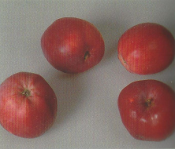"),
                    paste0("<b>Name: </b>", "Brasilgenapfel"),
                    paste0("<b>Aussehen: </b>", "Auffällige tiefrote Frucht"),
                    paste0("<b>Herkunft: </b>", "--"),
                    paste0("<b>Geschmack: </b>", "Süß"),
                    paste0("<b>Besonderheit: </b>", "Wird bei Lagerung schnell fade"),
                    paste0("<b>Verwendung: </b>", "Tafelapfel"),
                    paste0("<a href='https://shop.pomologen-verein.de/Obstsorten-regional/Alte-Obstsorten-neu-entdeckt-fuer-Niedersachsen%E2%80%93Bremen?source=2&refertype=7&referid=280", "'>Quelle</a>"))

trennfurter_goldrenette  <- paste(sep = "<br/>",
                    paste0(""),
                    paste0("<b>Name: </b>", "Trennfurter Goldrenette"),
                    paste0("<b>Aussehen: </b>", "Klein bis mittelgroß, Fruchtfleisch gelblichweiß, glatt"),
                    paste0("<b>Herkunft: </b>", "Trennfurt, um 1860"),
                    paste0("<b>Geschmack: </b>", "Saftig, angenehm gewürzt und aromatisch"),
                    paste0("<b>Besonderheit: </b>", "Robust und widerstandsfähig,<br> anspruchslos an Standort, <br> wächst auch auf Sand und steinigen Böden"),
                    paste0("<b>Verwendung: </b>", "Tafel-, Wirtschaftsapfel"),
                    paste0("<a href='https://www.schlaraffenburger.de/cms/index.php/dokumente/sortenbeschreibungen/431-sorten-portrait-trennfurter-renette/file", "'>Quelle</a>"))

```

```{r echo=FALSE}
leaflet(height=900, width=900) %>%
  addTiles() %>%
  setView(8.71137, 50.84844, zoom=20) %>%
  addAwesomeMarkers(49.25625, -37.58431 ,icon = icon_blue,group = "x") %>%
  addCircleMarkers(8.71136, 50.84835, color = "blue", popup=allendorfer_rosenapfel,group = "allendorfer",radius = 5) %>%
  addCircleMarkers(8.71174, 50.84812, color = "blue", popup=roter_rambur,group = "rambur",radius = 5) %>%
  addCircleMarkers(8.71150, 50.84812, color = "blue", popup=anhalter,group = "anhalter",radius = 5) %>%
  addCircleMarkers(8.71210, 50.84853, color = "blue", popup=ausbacher_roter,group = "ausbacher_roter",radius = 5) %>%
  addCircleMarkers(8.71149, 50.84802, color = "blue", popup=beerbacher_taffetapfel,group = "beerbacher_taffetapfel",radius = 5) %>%
  addCircleMarkers(8.71151, 50.84822, color = "blue", popup=berkersheimer_roter,group = "berkersheimer_roter",radius = 5) %>%
  addCircleMarkers(8.71161, 50.84817, color = "blue", popup=bischofsmuetze,group = "bischofsmütze",radius = 5) %>%
  addCircleMarkers(8.71170, 50.84891, color = "blue", popup=brakeler,group = "brakeler",radius = 5) %>%
  addCircleMarkers(8.71198, 50.84802, color = "blue", popup=burgstaedter_roter,group = "burgstädter_roter",radius = 5) %>%
  addCircleMarkers(8.71174, 50.84821, color = "blue",popup=ditzels_rosenapfel,group = "ditzels_rosenapfel",radius = 5) %>%
  addCircleMarkers(8.71110, 50.84870, color = "blue",popup=doppelter_prinzenapfel,group = "doppelter_prinzenapfel",radius = 5) %>%
  addCircleMarkers(8.71161, 50.84835, color = "blue",popup=dorheimer_streifling,group = "dorheimer_streifling",radius = 5) %>%
  addCircleMarkers(8.71111, 50.84790, color = "blue",popup=freinsheimer_taffetapfel,group = "freinsheimer_taffetapfel",radius = 5) %>%
  addCircleMarkers(8.71112, 50.84860, color = "blue",popup=freudenberger_nuetzerling,group = "freudenberger_nützerling",radius = 5) %>%
  addCircleMarkers(8.71124, 50.84847, color = "blue",popup=gacksapfel,group = "gacksapfel",radius = 5) %>%
  addCircleMarkers(8.71137, 50.84843, color = "blue",popup=hartapfel,group = "Hartapfel",radius = 5) %>%
  addCircleMarkers(8.71112, 50.84781, color = "blue",popup=heimeldinger,group = "heimeldinger",radius = 5) %>%
  addCircleMarkers(8.71087, 50.84779, color = "blue",popup=herrgottsapfel,group = "Herrgottsapfel",radius = 5) %>%
  addCircleMarkers(8.71161, 50.84826, color = "red",popup="Herrnapfel",radius = 5) %>%
  addCircleMarkers(8.71149, 50.84840, color = "blue",popup=heuchelheimer_schneeapfel,group = "Heuchelheimer_schneeapfel",radius = 5) %>%
  addCircleMarkers(8.71173, 50.84829, color = "blue",popup=himbacher_gruener,group = "Himbacher_grüner",radius = 5) %>%
  addCircleMarkers(8.71112, 50.84834, color = "blue",popup=hochzeitsapfel,group = "Hochzeitsapfel",radius = 5) %>%
  addCircleMarkers(8.71137, 50.84870, color = "red",popup="Jagdapfel",radius = 5) %>%
  addCircleMarkers(8.71101, 50.84831, color = "blue",popup=jakob_fischer,group = "Jakob_fischer",radius = 5) %>%
  addCircleMarkers(8.71198, 50.84847, color = "blue",popup=kaesapfel,group = "Käsapfel",radius = 5) %>%
  addCircleMarkers(8.71124, 50.84822, color = "blue",popup=kloppenheimer_streifling,group = "Kloppenheimer_streifling",radius = 5) %>%
  addCircleMarkers(8.71148, 50.84874, color = "blue",popup=korbacher_edelrenette,group = "Korbacher_edelrenette",radius = 5) %>%
  addCircleMarkers(8.71197, 50.84874, color = "blue",popup=koerler_edelapfel,group = "Körler_Edelapfel",radius = 5) %>%
  addCircleMarkers(8.71161, 50.84790, color = "blue",popup=kumpfenapfel,group = "Kumpfenapfel",radius = 5) %>%
  addCircleMarkers(8.71098, 50.84784, color = "blue",popup=lautertaler_waldapfel,group = "Lautertaler_Waldapfel",radius = 5) %>%
  addCircleMarkers(8.71198, 50.84810, color = "red",popup=lohrer_rambur,group = "Lohrer_Rambur",radius = 5) %>%
  addCircleMarkers(8.71113, 50.84824, color = "blue",popup="Mensfelder Glanzrenette",radius = 5) %>%
  addCircleMarkers(8.71184, 50.84870, color = "blue",popup=metzrenette,group = "Metzrenette",radius = 5) %>%
  addCircleMarkers(8.71198, 50.84892, color = "blue",popup=moringer_rosenapfel,group = "Moringer_Rosenapfel",radius = 5) %>%
  addCircleMarkers(8.71212, 50.84812, color = "red",popup="Münnerstädter",radius = 5) %>%
  addCircleMarkers(8.71237, 50.84889, color = "blue",popup=notarisapfel,group = "Notarisapfel",radius = 5) %>%
  addCircleMarkers(8.71222, 50.84839, color = "blue",popup=pflankenapfel,group = "Pflankenapfel",radius = 5) %>%
  addCircleMarkers(8.71199, 50.84818, color = "blue",popup=reders_goldrenette,group = "Reders_Goldrenette",radius = 5) %>%
  addCircleMarkers(8.71099, 50.84794, color = "blue",popup=roter_augustiner,group = "Roter_Augustiner",radius = 5) %>%
  addCircleMarkers(8.71136, 50.84807, color = "blue",popup=ruhm_von_kelsterbach,group = "Ruhm_von_Kelsterbach",radius = 5) %>%
  addCircleMarkers(8.71185, 50.84798, color = "blue",popup=schoener_von_miltenberg,group = "Schöner_von_Miltenberg",radius = 5) %>%
  addCircleMarkers(8.71246, 50.84884, color = "blue",popup=schoener_von_nordhausen,group = "Schöner_von_Nordhausen",radius = 5) %>%
  addCircleMarkers(8.71112, 50.84807, color = "blue",popup=schwarzschillernder_kohlapfel,group = "Schwarzschillernder_Kohlapfel",radius = 5) %>%
  addCircleMarkers(8.71124, 50.84838, color = "blue",popup=siebenschlaefer,group = "Siebenschläfer",radius = 5) %>%
  addCircleMarkers(8.71136, 50.84816, color = "blue",popup=sossenheimer_roter,group = "Sossenheimer Roter",radius = 5) %>%
  addCircleMarkers(8.71160, 50.84807, color = "blue",popup=spitzrabau,group = "Spitzrabau",radius = 5) %>%
  addCircleMarkers(8.71185, 50.84815, color = "blue",popup=steinbacher,group = "Steinbacher",radius = 5) %>%
  addCircleMarkers(8.71110, 50.84887, color = "blue",popup=tannenkrueger,group = "Tannenkrüger",radius = 5) %>%
  addCircleMarkers(8.71194, 50.84883, color = "blue",popup=tiefenbluete,group = "Tiefenblüte",radius = 5) %>%
  addCircleMarkers(8.71184, 50.84888, color = "blue",popup=trendelburger_calville,group = "Trendelburger_Calville",radius = 5) %>%
  addCircleMarkers(8.71171, 50.84841, color = "blue",popup=tulpenapfel,group = "Tulpenapfel",radius = 5) %>%
  addCircleMarkers(8.71186, 50.84879, color = "blue", popup=vaterapfel,group = "Vaterapfel",radius = 5) %>%
  addCircleMarkers(8.71088, 50.84772, color = "blue", popup=weinroeschen,group = "Weinröschen",radius = 5) %>%
  addCircleMarkers(8.71125, 50.84874, color = "blue", popup=westfaelischer_guelderling,group = "Westfälischer_Gülderling",radius = 5) %>%
  addCircleMarkers(8.71099, 50.84802, color = "red",popup="Alsenzer Weihnachtsapfel",radius = 5) %>%
  addCircleMarkers(8.71185, 50.84807, color = "red",popup="Amrheins Apfel",radius = 5) %>%                  
  addCircleMarkers(8.71159, 50.84889, color = "red",popup="Borlinghäuser Edelapfel",radius = 5) %>%
  addCircleMarkers(8.71232, 50.84898, color = "blue",popup=brasilgenapfel,group = "Brasilgenapfel",radius = 5) %>%
  addCircleMarkers(8.71148, 50.84794, color = "red",popup="Breitenbacher Wilder",radius = 5) %>%
  addCircleMarkers(8.71210, 50.84835, color = "red",popup="Bulcher",radius = 5) %>%
  addCircleMarkers(8.71135, 50.84886, color = "red",popup="Bürener Zitronenapfel ",radius = 5) %>%
  addCircleMarkers(8.71147, 50.84847, color = "red",popup="Fellinghäuser Weißapfel ",radius = 5) %>%
  addCircleMarkers(8.71109, 50.84879, color = "red",popup="Geseker Klosterapfel ",radius = 5) %>%
  addCircleMarkers(8.71172, 50.84857, color = "red",popup="Glasapfel ",radius = 5) %>%
  addCircleMarkers(8.71123, 50.84883, color = "red",popup="Graue Westf. Renette",radius = 5) %>%
  addCircleMarkers(8.71111, 50.84852, color = "red",popup="Grummelore",radius = 5) %>%
  addCircleMarkers(8.71172, 50.84865, color = "red",popup="Hainaer Klosterapfel",radius = 5) %>%
  addCircleMarkers(8.71124, 50.84829, color = "red",popup="Hartmännerscher",radius = 5) %>%
  addCircleMarkers(8.71210, 50.84825, color = "red",popup="Herschfelder Rambur",radius = 5) %>% 
  addCircleMarkers(8.71147, 50.84866, color = "red",popup="Hessischer Backapfel",radius = 5) %>%
  addCircleMarkers(8.71185, 50.84852, color = "red",popup="Hinchesapfel",radius = 5) %>%
  addCircleMarkers(8.71125, 50.84812, color = "red",popup="Igstädter Bohnapfel",radius = 5) %>%
  addCircleMarkers(8.71136, 50.84851, color = "red",popup="Kaiserkrone von Waldgirmes",radius = 5) %>%
  addCircleMarkers(8.71184, 50.84835, color = "red",popup="Krafts Jasminapfel",radius = 5) %>%
  addCircleMarkers(8.71099, 50.84812, color = "red",popup="Langenhainer Würzapfel",radius = 5) %>%
  addCircleMarkers(8.71123, 50.84856, color = "red",popup="Linnejakobs Sauerapfel",radius = 5) %>%
  addCircleMarkers(8.71100, 50.84847, color = "red",popup="Mauerapfel",radius = 5) %>%
  addCircleMarkers(8.71160, 50.84852, color = "red",popup="Merlapfel",radius = 5) %>%
  addCircleMarkers(8.71172, 50.84875, color = "red",popup="Naumburger Schafsnase",radius = 5) %>%
  addCircleMarkers(8.71136, 50.84860, color = "red",popup="Niederdietener Süßapfel",radius = 5) %>%
  addCircleMarkers(8.71098, 50.84775, color = "red",popup="Pfälzer Schafsnase",radius = 5) %>%
  addCircleMarkers(8.71160, 50.84799, color = "red",popup="Pflasterapfel",radius = 5) %>%
  addCircleMarkers(8.71187, 50.84861, color = "red",popup="Quillapfel",radius = 5) %>%
  addCircleMarkers(8.71102, 50.84822, color = "red",popup="Rambacher Rosenapfel",radius = 5) %>%
  addCircleMarkers(8.71112, 50.84817, color = "red",popup="Schiersteiner Schöner",radius = 5) %>%
  addCircleMarkers(8.71152, 50.84786, color = "red",popup="Schöner vom Neckartal",radius = 5) %>%
  addCircleMarkers(8.71100, 50.84840, color = "red",popup="Schuyapfel",radius = 5) %>%
  addCircleMarkers(8.71221, 50.84828, color = "red",popup="Seebaer Borsdorfer",radius = 5) %>%
  addCircleMarkers(8.71161, 50.84861, color = "red",popup="Spitzapfel Amönau",radius = 5) %>%
  addCircleMarkers(8.71248, 50.84893, color = "red",popup="Stolberger Schlossapfel",radius = 5) %>%
  addCircleMarkers(8.71210, 50.84844, color = "red",popup="Streifapfel",radius = 5) %>%
  addCircleMarkers(8.71173, 50.84793, color = "blue",popup=trennfurter_goldrenette,group = "trennfurter_goldrenette",radius = 5) %>%
  addCircleMarkers(8.71159, 50.84880, color = "red",popup="Twister Apfel",radius = 5) %>%
  addCircleMarkers(8.71125, 50.84802, color = "red",popup="Veldenzer",radius = 5) %>%
  addCircleMarkers(8.71160, 50.84870, color = "red",popup="Waldeck Nr. 1",radius = 5) %>%
  addCircleMarkers(8.71173, 50.84802, color = "red",popup="Wallstädter Rosenapfel",radius = 5) %>%
  addCircleMarkers(8.71173, 50.84848, color = "red",popup="Warthof",radius = 5) %>%
  addCircleMarkers(8.71111, 50.84843, color = "red",popup="Weisser Matapfel",radius = 5) %>%
  addCircleMarkers(8.71148, 50.84884, color = "red",popup="Westfälischer Frühapfel",radius = 5) %>%
  addCircleMarkers(8.71123, 50.84865, color = "red",popup="Wittgensteiner Glasapfel",radius = 5) %>%
  addCircleMarkers(8.71207, 50.84880, color = "red",popup="Witzenhäuser Riesen",radius = 5) %>%
  addCircleMarkers(8.71147, 50.84858, color = "red",popup="Zens Taubenapfel",radius = 5) %>%
  addLegend(
  position = "bottomright",
  colors = c("#3b59ec","red"),
  labels = c("Mit Beschreibung","Ohne Beschreibung"), opacity = 1,
  title = "Apfelbäume auf der Hessenwiese"
)
```

## Darstellung der Standorte in Hessen
```{r echo=FALSE}
leaflet(height=900, width=900) %>%
  addTiles() %>%
  setView(8.62347, 50.58887, zoom=8) %>%
  addAwesomeMarkers(49.25625, -37.58431 ,icon = icon_blue) %>%
  addCircleMarkers(8.53842,	50.48853, color = "blue",popup=allendorfer_rosenapfel,radius = 7) %>%
  addCircleMarkers(9.19761,	49.98833, color = "blue",popup=roter_rambur,radius = 7) %>%
  addCircleMarkers(8.71166,	49.97661, color = "blue",popup=anhalter,radius = 7) %>%
  addCircleMarkers(9.67579,	50.78403, color = "blue",popup=ausbacher_roter,radius = 7) %>%
  addCircleMarkers(8.68458,	49.77390, color = "blue",popup=beerbacher_taffetapfel,radius = 7) %>%
  addCircleMarkers(8.69854,	50.17402, color = "blue",popup=berkersheimer_roter,radius = 7) %>% 
  addCircleMarkers(8.95066,	50.07196, color = "blue",popup=bischofsmuetze,radius = 7) %>%
  addCircleMarkers(9.23572,	51.63400, color = "blue",popup=brakeler,radius = 7) %>%
  addCircleMarkers(9.62778,	49.79317, color = "blue",popup=burgstaedter_roter,radius = 7) %>%
  addCircleMarkers(9.20884,	50.16175, color = "blue",popup=ditzels_rosenapfel,radius = 7) %>%
  addCircleMarkers(8.06372,	51.13788, color = "blue",popup=doppelter_prinzenapfel,radius = 7) %>%
  addCircleMarkers(9.00792,	50.41497, color = "blue",popup=dorheimer_streifling,radius = 7) %>%
  addCircleMarkers(8.21084,	49.50667, color = "blue",popup=freinsheimer_taffetapfel,radius = 7) %>%
  addCircleMarkers(8.01178,	51.01742, color = "blue",popup=freudenberger_nuetzerling,radius = 7) %>%
  addCircleMarkers(8.35736,	50.70673, color = "blue",popup=gacksapfel,radius = 7) %>%
  addCircleMarkers(8.53248,	50.60913, color = "blue",popup=hartapfel,radius = 7) %>%
  addCircleMarkers(8.07126,	49.31520, color = "blue",popup=heimeldinger,radius = 7) %>%
  addCircleMarkers(7.61029,	49.41527, color = "blue",popup=herrgottsapfel,radius = 7) %>%
  addCircleMarkers(9.04425,	50.21198, color = "red",popup="Herrnapfel",radius = 7) %>%
  addCircleMarkers(8.62347,	50.58887, color = "blue",popup=heuchelheimer_schneeapfel,radius = 7) %>%
  addCircleMarkers(9.26008,	50.33845, color = "blue",popup=himbacher_gruener,radius = 7) %>%
  addCircleMarkers(8.10491,	50.51723, color = "blue",popup=hochzeitsapfel,radius = 7) %>%
  addCircleMarkers(8.48690,	51.15264, color = "red",popup="Jagdapfel",radius = 7) %>%
  addCircleMarkers(7.90374,	50.42770, color = "blue",popup=jakob_fischer,radius = 7) %>%
  addCircleMarkers(9.60755,	50.70167, color = "blue",popup=kaesapfel,radius = 7) %>%
  addCircleMarkers(8.34364,	50.16259, color = "blue",popup=kloppenheimer_streifling,radius = 7) %>%
  addCircleMarkers(8.74741,	51.27628, color = "blue",popup=korbacher_edelrenette,radius = 7) %>%
  addCircleMarkers(9.64148,	51.22392, color = "blue",popup=koerler_edelapfel,radius = 7) %>%
  addCircleMarkers(8.98054,	49.51871, color = "blue",popup=kumpfenapfel,radius = 7) %>%
  addCircleMarkers(7.96122,	49.49217, color = "blue",popup=lautertaler_waldapfel,radius = 7) %>%
  addCircleMarkers(9.60596,	49.98245, color = "blue",popup=lohrer_rambur,radius = 7) %>%
  addCircleMarkers(8.11297,	50.29008, color = "red",popup="Mensfelder Glanzrenette",radius = 7) %>%
  addCircleMarkers(9.41897,	51.14296, color = "blue",popup=metzrenette,radius = 7) %>%
  addCircleMarkers(9.61970,	51.54579, color = "blue",popup=moringer_rosenapfel,radius = 7) %>%
  addCircleMarkers(9.79688,	50.05970, color = "red",popup="Münnerstädter",radius = 7) %>%
  addCircleMarkers(10.23011, 51.47274, color = "blue",popup=notarisapfel,radius = 7) %>%
  addCircleMarkers(10.05652,	50.49221, color = "blue",popup=pflankenapfel,radius = 7) %>%
  addCircleMarkers(9.60985,	50.15024, color = "blue",popup=reders_goldrenette,radius = 7) %>%
  addCircleMarkers(7.88366,	49.68606, color = "blue",popup=roter_augustiner,radius = 7) %>%
  addCircleMarkers(8.52632,	49.98733, color = "blue",popup=ruhm_von_kelsterbach,radius = 7) %>%
  addCircleMarkers(9.33883,	49.69644, color = "blue",popup=schoener_von_miltenberg,radius = 7) %>%
  addCircleMarkers(10.61920,	51.34193, color = "blue",popup=schoener_von_nordhausen,radius = 7) %>%
  addCircleMarkers(8.16532,	49.91799, color = "blue",popup=schwarzschillernder_kohlapfel,radius = 7) %>%
  addCircleMarkers(8.27889,	50.52346, color = "blue",popup=siebenschlaefer,radius = 7) %>%
  addCircleMarkers(8.46401,	50.08835, color = "blue",popup=sossenheimer_roter,radius = 7) %>%
  addCircleMarkers(8.99878,	49.85461, color = "blue",popup=spitzrabau,radius = 7) %>%
  addCircleMarkers(9.40116,	50.08125, color = "blue",popup=steinbacher,radius = 7) %>%
  addCircleMarkers(8.06718,	51.55522, color = "blue",popup=tannenkrueger,radius = 7) %>%
  addCircleMarkers(9.63049,	51.42894, color = "blue",popup=tiefenbluete,radius = 7) %>%
  addCircleMarkers(9.42991,	51.56890, color = "blue",popup=trendelburger_calville,radius = 7) %>%
  addCircleMarkers(9.02437,	50.65288, color = "blue",popup=tulpenapfel,radius = 7) %>%
  addCircleMarkers(9.41492,	51.31493, color = "blue",popup=vaterapfel,radius = 7) %>%
  addCircleMarkers(7.70647,	49.23803, color = "blue",popup=weinroeschen,radius = 7) %>%
  addCircleMarkers(8.39075,	51.20689, color = "blue",popup=westfaelischer_guelderling,radius = 7) %>%
  addCircleMarkers(7.86162,	49.81868, color = "red",popup="Alsenzer Weihnachtsapfel",radius = 7) %>%
  addCircleMarkers(9.40773,	49.86455, color = "red",popup="Amrheins Apfel",radius = 7) %>%
  addCircleMarkers(9.04237,	51.51288, color = "red",popup="Borlinghäuser Edelapfel",radius = 7) %>%
  addCircleMarkers(10.32991,	51.72277, color = "blue",popup=brasilgenapfel,radius = 7) %>%
  addCircleMarkers(8.71927,	49.66002, color = "red",popup="Breitenbacher Wilder",radius = 7) %>%
  addCircleMarkers(9.82500,	50.37255, color = "red",popup="Bulcher",radius = 7) %>%
  addCircleMarkers(8.56383,	51.55274, color = "red",popup="Bürener Zitronenapfel ",radius = 7) %>%
  addCircleMarkers(8.73127,	50.71360, color = "red",popup="Fellinghäuser Weißapfel ",radius = 7) %>%
  addCircleMarkers(8.13078,	51.35480, color = "red",popup="Geseker Klosterapfel ",radius = 7) %>%
  addCircleMarkers(9.16769,	50.90375, color = "red",popup="Glasapfel ",radius = 7) %>%
  addCircleMarkers(8.38240,	51.43851, color = "red",popup="Graue Westf. Renette",radius = 7) %>%
  addCircleMarkers(8.09303,	50.83624, color = "red",popup="Grummelore",radius = 7) %>%
  addCircleMarkers(9.18343,	51.04328, color = "red",popup="Hainaer Klosterapfel",radius = 7) %>%
  addCircleMarkers(8.29489,	50.40630, color = "red",popup="Hartmännerscher",radius = 7) %>%
  addCircleMarkers(9.85720,	50.19085, color = "red",popup="Herschfelder Rambur",radius = 7) %>%
  addCircleMarkers(8.75110,	51.09092, color = "red",popup="Hessischer Backapfel",radius = 7) %>%
  addCircleMarkers(9.38625,	50.74112, color = "red",popup="Hinchesapfel",radius = 7) %>%
  addCircleMarkers(8.32889,	50.08185, color = "red",popup="Igstädter Bohnapfel",radius = 7) %>%
  addCircleMarkers(8.55330,	50.64809, color = "red",popup="Kaiserkrone von Waldgirmes",radius = 7) %>%
  addCircleMarkers(9.43156,	50.37515, color = "red",popup="Krafts Jasminapfel",radius = 7) %>%
  addCircleMarkers(7.88452,	50.00550, color = "red",popup="Langenhainer Würzapfel",radius = 7) %>%
  addCircleMarkers(8.28757,	50.87564, color = "red",popup="Linnejakobs Sauerapfel",radius = 7) %>%
  addCircleMarkers(7.87858,	50.76513, color = "red",popup="Mauerapfel",radius = 7) %>%
  addCircleMarkers(8.94060,	50.80583, color = "red",popup="Merlapfel",radius = 7) %>%
  addCircleMarkers(9.16099,	51.24717, color = "red",popup="Naumburger Schafsnase",radius = 7) %>%
  addCircleMarkers(8.53336,	50.99293, color = "red",popup="Niederdietener Süßapfel",radius = 7) %>%
  addCircleMarkers(7.84791,	49.30705, color = "red",popup="Pfälzer Schafsnase",radius = 7) %>%
  addCircleMarkers(9.01523,	49.74115, color = "red",popup="Pflasterapfel",radius = 7) %>%
  addCircleMarkers(9.30501,	50.98763, color = "red",popup="Quillapfel",radius = 7) %>%
  addCircleMarkers(7.88840,	50.17598, color = "red",popup="Rambacher Rosenapfel",radius = 7) %>%
  addCircleMarkers(8.12702,	50.07075, color = "red",popup="Schiersteiner Schöner",radius = 7) %>%
  addCircleMarkers(8.83620,	49.45421, color = "red",popup="Schöner vom Neckartal",radius = 7) %>%
  addCircleMarkers(7.99116,	50.57012, color = "red",popup="Schuyapfel",radius = 7) %>%
  addCircleMarkers(10.06445,	50.26540, color = "red",popup="Seebaer Borsdorfer",radius = 7) %>%
  addCircleMarkers(8.84636,	50.94613, color = "red",popup="Spitzapfel Amönau",radius = 7) %>%
  addCircleMarkers(10.54601,	51.55459, color = "red",popup="Stolberger Schlossapfel",radius = 7) %>%
  addCircleMarkers(9.88768,	50.59022, color = "red",popup="Streifapfel",radius = 7) %>%
  addCircleMarkers(9.24866,	49.62069, color = "blue",popup=trennfurter_goldrenette,radius = 7) %>%
  addCircleMarkers(8.94656,	51.37325, color = "red",popup="Twister Apfel",radius = 7) %>%
  addCircleMarkers(8.33952,	49.84398, color = "red",popup="Veldenzer",radius = 7) %>%
  addCircleMarkers(8.98704,	51.16360, color = "red",popup="Waldeck Nr. 1",radius = 7) %>%
  addCircleMarkers(9.19396,	49.78694, color = "red",popup="Wallstädter Rosenapfel",radius = 7) %>%
  addCircleMarkers(9.14296,	50.69971, color = "red",popup="Warthof",radius = 7) %>%
  addCircleMarkers(8.09555,	50.67253, color = "red",popup="Weisser Matapfel",radius = 7) %>%
  addCircleMarkers(8.70614,	51.41603, color = "red",popup="Westfälischer Frühapfel",radius = 7) %>%
  addCircleMarkers(8.35233,	51.06729, color = "red",popup="Wittgensteiner Glasapfel",radius = 7) %>%
  addCircleMarkers(9.85611,	51.32031, color = "red",popup="Witzenhäuser Riesen",radius = 7) %>%
  addCircleMarkers(8.79909,	50.88517, color = "red",popup="Zens Taubenapfel",radius = 7) %>%
  addLegend(
  position = "bottomright",
  colors = c("#3b59ec","red"),
  labels = c("Mit Beschreibung","Ohne Beschreibung"), opacity = 1,
  title = "Verbreitung der Apfelbäume der Hessenwiese"
)
```